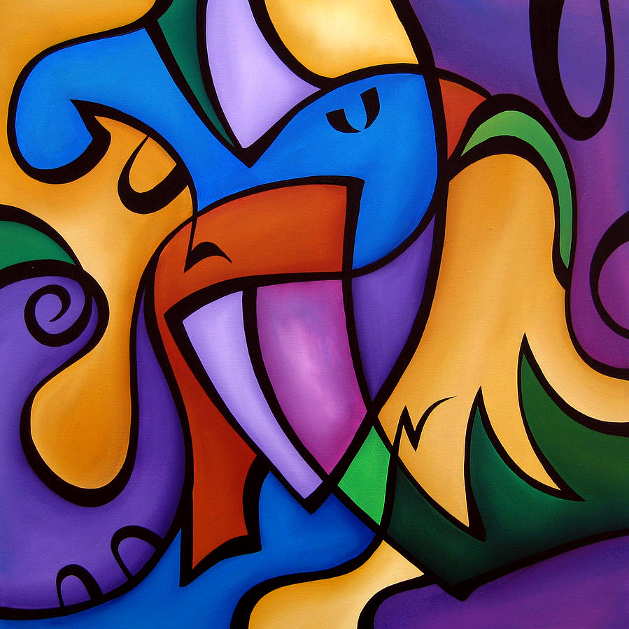

# cs390_lab3

## Name: Rishabh Rajesh

<br>

## Usage and examples:

### Usage:
```
python lab3.py --style_image_path <path to style image> --content_image_path <path to content image> --epochs <number of epochs> --view_before_saving <True or False>
```

### Examples:

```
python --style_image_path ./images/style/geometric.jpg --content_image_path ./images/content/nothingwasthesame.jpg --epochs 200
```

```
python --style_image_path ./images/style/blackandwhitemosaic.jpg --content_image_path ./images/content/10000days.jpg --view_before_saving
```

**Note: View Before Saving argument will override/ignore supplied epochs argument**


## Results:

### Theme: Album Covers
<br>

Content + Style = Result
<br>
<br>

### 10000 days by Tool + Mosaic Style
<div style="text-align: center;">
    
    
    
</div>
<br>
<br>
<br>

### Starboy by The Weeknd + Starry Night
<div style="text-align: center;">
    
    
    
</div>
<br>
<br>
<br>

### American Idiot by Green Day + Fire Style
<div style="text-align: center;">
    
    
    
</div>
<br>
<br>
<br>

### Dark Side of The Moon by Pink Floyd + Mosaic Style
<div style="text-align: center;">
    
    
    
</div>
<br>
<br>
<br>

### Nothing Was The Same by Drake + Geometric Style
<div style="text-align: center;">
    
    
    
</div>
<br>
<br>
<br>

### Night Visions by Imagine Dragons + Abstract Style
<div style="text-align: center;">
    
    
    
</div>
<br>
<br>
<br>

### Crush by Lettuce + Sorceress by Opeth
<div style="text-align: center;">
    
    
    
</div>

## References:
1. https://arxiv.org/pdf/1508.06576.pdf&sa=D&source=editors&ust=1616550861348000&usg=AOvVaw1jEGIC_6I67vuRWRBTaWf4

2. https://pytorch.org/tutorials/advanced/neural_style_tutorial.html

3. https://www.vincit.com/blog/experimenting-with-style-transfer-using-pytorch